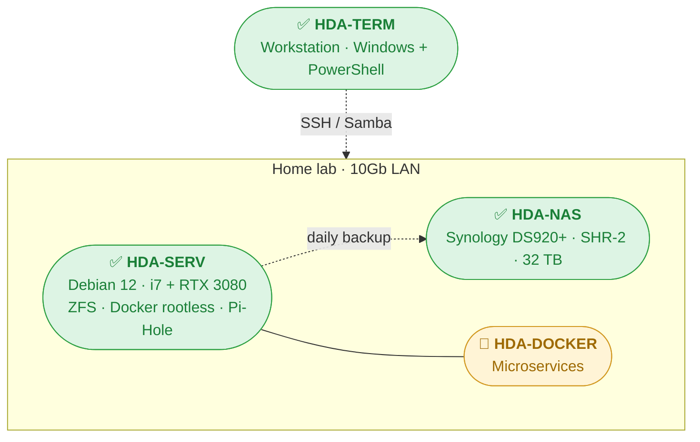

# Yasser Fuentes

**Head of ML Modeling @ Tritemius** · **PhD in Physics** · **Madrid**

*Construir para entender.*

---

Physicist turned ML engineer. Currently leading ML modeling at **Tritemius** — fine-tuned transformers for Solidity smart-contract vulnerability detection, blockchain fraud analysis, and mempool monitoring.

Before: co-founded [Translucent Datalab](https://translucentdatalab.com), an IE University spin-off processing 4M+ pages/month to map illegal online pharma markets for Fortune 500 pharma and US regulators. And before that, years firing femtosecond lasers at materials at CSIC — 12 peer-reviewed papers, ~900 citations, h-index 10.

I also [blog](https://yassfuentes.es), write poetry, play flamenco badly, and go birdwatching.

---

### Tech Stack

  
  
  
  
  
  
  
  
  

**Currently exploring:** RAG architectures · LangChain · k3s · OpenTofu · Ansible · Chezmoi · Proxmox

---

### Featured open source

| Project | What it is |
|---------|------------|
| [**obsidian-at-people**](https://github.com/backmind/obsidian-at-people) | Fuzzy `@` mentions for Obsidian. **Official community plugin** — my PR led the original author to archive his repo and endorse this fork. 8.3k+ downloads. |
| [**tutorials**](https://github.com/backmind/tutorials) | Four-layer homelab documentation series (see below). |
| [**prismfly**](https://github.com/backmind/prismfly) | Firefly III analytics: personal inflation index, lifestyle elasticity, sustainability waterfall. 10 years of hand-recorded data → interactive dashboard + LLM-ready report. |

---

### Homelab Documentation Series

Four-layer architecture for personal infrastructure → [**backmind/tutorials**](https://github.com/backmind/tutorials)

| Guide | Covers |
|-------|--------|
| **[HDA-NAS](https://github.com/backmind/tutorials/blob/main/hda-nas.md)** | Synology DS920+ setup, disk selection, RAID/SHR-2, hardware testing |
| **[HDA-SERV](https://github.com/backmind/tutorials/blob/main/hda-serv.md)** | Debian 12 headless: SSH hardening, ZFS, Samba, Docker rootless, CUDA, Pi-Hole |
| **[HDA-TERM](https://github.com/backmind/tutorials/blob/main/hda-term.md)** | Windows Terminal + PowerShell 7: Oh My Posh, fzf, z, UV, productivity aliases |
| **HDA-DOCKER** | Microservices stack *(in progress)* |

---

### Research & academic

| Project | Description |
|---------|-------------|
| [autoRICEWQ](https://github.com/backmind/autoRICEWQ) | Batch handler for RICEWQ hydric simulations — scales from dozens to tens of thousands of runs. **Used in 2 peer-reviewed papers.** |
| [EspeciesInvasoras-MITECO](https://github.com/backmind/EspeciesInvasoras-MITECO) | Web scraping + PDF/GIS processing of Spain's MITECO invasive species registry |

---

### Personal projects

<b>📰 Feeds & scrapers</b>

 

| Project | Description |
|---------|-------------|
| [Bird-of-the-day](https://github.com/backmind/Bird-of-the-day) | Daily bird species RSS feed and static site, self-hostable as a microservice → [live instance](https://birds.yassfuentes.es) |
| [Palabra-del-dia](https://github.com/backmind/Palabra-del-dia) | Ad-free Atom feed of daily Spanish etymology from elcastellano.org |
| [anait-games-calendar](https://github.com/backmind/anait-games-calendar) | iCal feed of weekly video game releases from AnaitGames |
| [EOM-Scraper](https://github.com/backmind/EOM-Scraper) | El Orden Mundial → Readwise Reader |

<b>💻 Developer tools</b>

 

| Project | Description |
|---------|-------------|
| [ClaudeUsage](https://github.com/backmind/ClaudeUsage) | PowerShell module to query Claude Code usage limits from the terminal |
| [PSAliasFinder](https://github.com/backmind/PSAliasFinder) | PowerShell alias discovery — suggests existing aliases when you type the verbose form. Inspired by oh-my-zsh's `alias-finder` |
| [termux-widget-git-obsidian](https://github.com/backmind/termux-widget-git-obsidian) | Termux shortcuts for git-syncing your Obsidian vault from Android |
| [domestika-downloader](https://github.com/backmind/domestika-downloader) | Fork with concurrency + H.265 transcode. PR submitted upstream |

<b>💰 Personal finance</b>

 

| Project | Description |
|---------|-------------|
| [MyWallet-to-Fireflyiii](https://github.com/backmind/MyWallet-to-Fireflyiii) | ETL from the (deceased) MyWallet Android app to Firefly III |
| [SimuladorHipoteca](https://github.com/backmind/SimuladorHipoteca) | Mortgage simulator for amortization strategy analysis |

---

  

